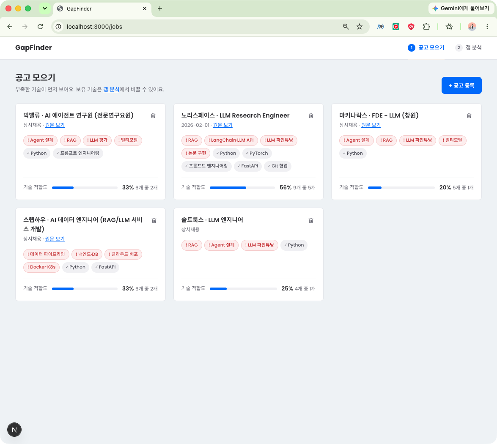
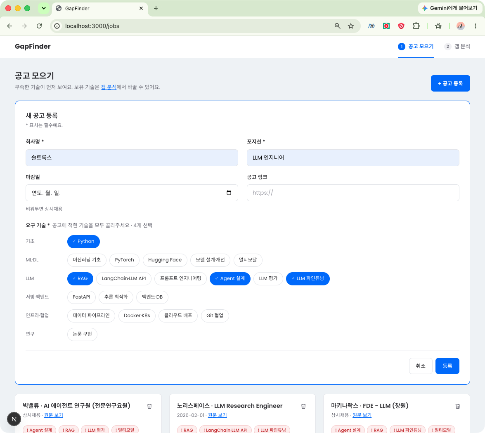
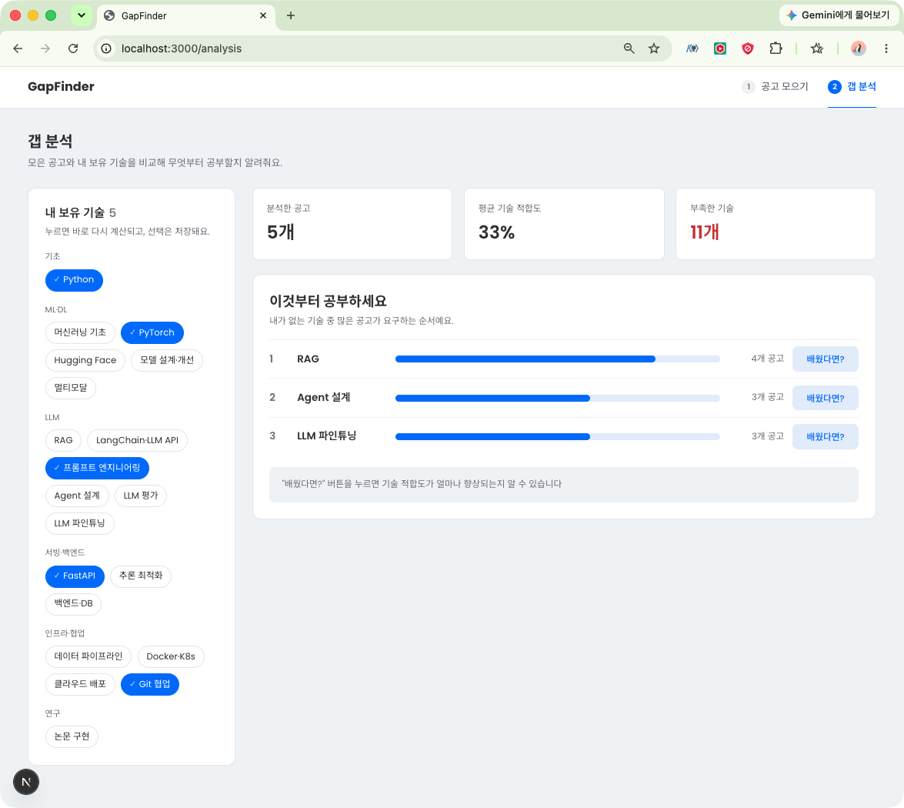

# GapFinder

채용 공고를 모아 **내가 가진 기술과 비교하고, 무엇부터 공부할지** 알려주는 Next.js 기반 개인 프로젝트입니다.

- 개발 기간: 2026.09.28 ~ 2026.10.02 (5일)
- 주요 사용자: 지원하고 싶은 직무는 있는데 공고마다 요구하는 조건이 달라, 어떤 기술부터 공부해야 할지 정하기 어려운 개발직군 취업 준비생
- 제작 목적: 공고를 읽고 감으로 판단하던 것을, 여러 공고에서 **부족한 기술이 몇 번 요구되는지** 숫자로 보고 학습 순서를 정할 수 있도록 제작했습니다.

> 어떤 공고에 지원할지를 추천하는 서비스가 아니라, **공부할 기술의 우선순위**를 정하는 서비스입니다.

### 사용 흐름

```
① 공고 모으기 (/jobs)                 ② 갭 분석 (/analysis)
관심 공고 등록 · 삭제        →        내 보유 기술 체크
공고별 부족한 기술 확인               먼저 공부할 기술 TOP 3 확인
                                      "배웠다면?"으로 효과 미리 보기
```

---

## 주요 기능

| 기능                 | 주소        | 설명                                                                                                                                                        |
| -------------------- | ----------- | ----------------------------------------------------------------------------------------------------------------------------------------------------------- |
| 공고 등록            | `/jobs`     | 회사명·포지션·마감일·링크를 입력하고, 요구 기술을 체크해 공고를 등록할 수 있습니다. 마감일을 비워두면 상시채용으로 저장됩니다.                              |
| 공고 목록·삭제       | `/jobs`     | 등록한 공고를 카드로 확인하고 삭제할 수 있습니다. 카드마다 보유 기술(✓)과 부족한 기술(!)이 구분되고, 부족한 기술이 앞에 정렬되며, 기술 적합도가 표시됩니다. |
| 갭 분석              | `/analysis` | 내 보유 기술을 체크하면 평균 기술 적합도, 부족한 기술 수, **먼저 공부할 기술 TOP 3**를 바로 다시 계산해 보여줍니다.                                         |
| 학습 효과 시뮬레이션 | `/analysis` | TOP 3 기술의 "배웠다면?"을 누르면, 그 기술을 익혔을 때 평균 기술 적합도가 몇 %p 오르는지 미리 볼 수 있습니다. 실제 보유 기술은 바뀌지 않습니다.             |

- 보유 기술은 브라우저에 저장되어 새로고침해도 유지되고, 두 화면에서 함께 사용됩니다.
- 불러오는 중·불러오기 실패·공고 없음·보유 기술 없음 상태마다 안내 화면을 보여줍니다. 이때도 등록 폼과 보유 기술 선택 영역은 그대로 유지됩니다.
- 등록 요청 중에는 버튼을 잠가 같은 공고가 두 번 등록되지 않도록 했습니다.

### 계산 방식

계산 결과는 저장하지 않고, 공고나 보유 기술이 바뀔 때마다 다시 계산합니다.

| 항목                   | 계산식                                                                     |
| ---------------------- | -------------------------------------------------------------------------- |
| 기술 적합도 (공고 1개) | 보유한 요구 기술 수 ÷ 공고의 요구 기술 수 × 100 (마지막에 한 번 반올림)    |
| 평균 기술 적합도       | 공고별 기술 적합도의 평균 (공고마다 같은 비중, 0%인 공고도 포함)           |
| 학습 우선순위          | 내가 없는 기술을 **요구하는 공고 수**가 많은 순서 (같으면 기술 목록 순서)  |
| 시뮬레이션             | 보유 기술에 해당 기술 1개를 더했다고 가정하고 평균 기술 적합도를 다시 계산 |

**예시**: 공고 2개가 있고 보유 기술이 `Python`, `Git`일 때

| 공고 | 요구 기술                             | 기술 적합도      |
| ---- | ------------------------------------- | ---------------- |
| A    | Python, RAG, Agent 설계, LLM 파인튜닝 | 4개 중 1개 → 25% |
| B    | Python, RAG, FastAPI, Git             | 4개 중 2개 → 50% |

- 평균 기술 적합도: (25 + 50) ÷ 2 = **38%**
- 학습 우선순위: RAG(2개 공고) → Agent 설계(1) → LLM 파인튜닝(1)
- RAG를 배웠다면: A 50%, B 75% → 평균 **63% (+25%p)**

---

## 화면 구성

### 공고 모으기 (`/jobs`)



등록한 공고를 카드로 보여줍니다. 부족한 기술(!)이 앞에 오고, 카드 하단에서 기술 적합도를 확인할 수 있습니다.

### 공고 등록 폼



요구 기술은 직접 입력하지 않고 고정된 기술 목록(20개)에서 선택합니다. `PyTorch` / `pytorch`처럼 표기가 달라 같은 기술이 다르게 집계되는 것을 막기 위해서입니다.

### 갭 분석 (`/analysis`)



왼쪽에서 보유 기술을 고르면 오른쪽 결과가 바로 바뀝니다. "배웠다면?"을 누르면 평균 기술 적합도 변화를 미리 보여줍니다.

---

## 기술 스택

| 기술                    | 사용한 곳                                                   |
| ----------------------- | ----------------------------------------------------------- |
| Next.js 16 (App Router) | 폴더 기반 라우팅, 루트 접속 시 `/jobs`로 리다이렉트         |
| React 19                | 화면 구성, `useState`·`useEffect`로 상태와 데이터 조회 관리 |
| JavaScript              | 전체 코드                                                   |
| Zustand 5 (`persist`)   | 두 페이지가 함께 쓰는 보유 기술을 저장 (localStorage)       |
| JSON Server 1.0         | 공고 데이터 조회·등록·삭제용 가짜 REST API                  |
| fetch API               | 서버 요청 (`api/jobApi.js`)                                 |
| CSS                     | `globals.css` 한 파일로 공통 스타일 관리                    |

---

## 설치 및 실행 방법

> Node.js 22 이상에서 실행해 주세요. (계산 함수에서 `Set.prototype.intersection`을 사용합니다.)

### 1. 저장소 복제

```bash
git clone https://github.com/sominshim/GapFinder.git
```

### 2. 프로젝트 폴더로 이동

```bash
cd GapFinder
```

### 3. 패키지 설치

```bash
npm install
```

### 4. JSON Server 실행

```bash
npm run server
```

### 5. Next.js 실행

새로운 터미널을 열어 실행합니다.

```bash
npm run dev
```

### 접속 주소

- Next.js: http://localhost:3000 (접속하면 `/jobs`로 이동합니다)
- JSON Server: http://localhost:4000/jobs

JSON Server와 Next.js는 각각 실행되어야 하므로 서로 다른 터미널에서 실행합니다. JSON Server가 꺼져 있으면 화면에 "공고를 불러오지 못했어요" 안내와 다시 시도 버튼이 나타납니다.

```json
{
    "scripts": {
        "dev": "next dev",
        "server": "json-server db.json --port 4000"
    }
}
```

---

## 폴더 구조

```
src/
├─ app/
│  ├─ layout.js        # 공통 레이아웃 (Header)
│  ├─ page.js          # / → /jobs 리다이렉트
│  ├─ jobs/page.js     # 공고 모으기
│  ├─ analysis/page.js # 갭 분석
│  └─ globals.css
├─ components/         # 화면을 구성하는 UI 컴포넌트
├─ api/                # 서버 요청 함수 (jobApi)
├─ stores/             # Zustand 공유 상태 (보유 기술)
├─ constants/          # 고정 데이터 (기술 목록 20개)
└─ utils/              # 계산 함수 (적합도, 요구 빈도, 학습 우선순위)
```

폴더는 **바뀌는 이유**를 기준으로 나눴습니다. 화면 모양, 서버 주소, 계산식, 기술 목록은 각각 다른 이유로 바뀌기 때문에, 하나를 고칠 때 다른 파일을 건드리지 않도록 분리했습니다.

- `constants/skills.js`: 사용자가 추가·수정하지 않는 고정 값이라 서버에서 받지 않고 코드에 두었습니다. 저장은 `id`(`"pytorch"`), 화면 표시는 `name`(`"PyTorch"`)을 사용합니다.
- `utils/analysis.js`: React와 상관없는 순수 계산 함수입니다. 공고 카드와 갭 분석 화면, 시뮬레이션이 같은 함수를 사용합니다.

---

## 주요 컴포넌트

| 컴포넌트         | 역할                                                                          |
| ---------------- | ----------------------------------------------------------------------------- |
| `Header`         | 상단 메뉴를 표시하고, 현재 주소에 맞는 메뉴를 강조합니다.                     |
| `JobForm`        | 공고 정보와 요구 기술을 입력받아 등록 요청을 보냅니다.                        |
| `JobCard`        | 공고 한 개의 정보, 요구 기술 칩, 기술 적합도를 표시합니다.                    |
| `SkillCard`      | 기술 칩 한 개를 표시합니다. 보유 여부(`owned`)에 따라 ✓ / ! 와 색이 바뀝니다. |
| `AnalysisResult` | 공고와 보유 기술을 받아 요약, 학습 우선순위 TOP 3, 시뮬레이션을 표시합니다.   |

```
jobs/page ── store에서 mySkills 읽기, 공고 조회
  ├─ JobForm         (등록 완료 시 handleCreated 호출)
  └─ JobCard × n     (job, mySkills)
       └─ SkillCard × n  (name, owned)

analysis/page ── store에서 mySkills 읽기, 공고 조회
  └─ AnalysisResult  (jobs, mySkills)
```

store는 **페이지에서만** 읽고, `JobCard`, `SkillCard`, `AnalysisResult`는 props로 받은 값만 사용합니다. 그래서 같은 입력이면 항상 같은 화면이 나오고, 보유 여부의 기준이 한 곳이라 적합도 문구와 ✓/! 칩이 항상 일치합니다.

## 상태 관리

| 상태                                    | 위치                | 이유                                                                                             |
| --------------------------------------- | ------------------- | ------------------------------------------------------------------------------------------------ |
| 보유 기술 `mySkills`                    | Zustand + `persist` | 두 **페이지**가 함께 쓰고, 새로고침 후에도 유지해야 합니다.                                      |
| 공고 목록 `jobData`, `loading`, `error` | 각 page             | 서버 데이터라 화면이 열릴 때 조회합니다. 등록 폼과 목록이 함께 쓰므로 공통 부모인 page에 둡니다. |
| 폼 열림 `isOpen`                        | `jobs/page`         | 등록 버튼, 취소, 등록 완료 후 닫기를 page에서 처리합니다.                                        |
| 입력값 `form`, 요청 중 `submitting`     | `JobForm`           | 폼 안에서만 쓰는 값입니다.                                                                       |
| 가정한 기술 `assumedSkill`              | `AnalysisResult`    | 시뮬레이션 결과 영역에서만 쓰는 값입니다.                                                        |

계산값(적합도, 우선순위)은 state로 저장하지 않습니다. 저장하면 원본(공고, 보유 기술)이 바뀔 때마다 함께 맞춰야 하므로, 렌더링할 때마다 계산합니다.

---

## 트러블슈팅

### 1. 공고를 등록해도 목록이 갱신되지 않는 문제

#### 처음 설계

로딩·에러·빈 상태일 때 **페이지 전체가 아니라 목록 자리만** 바꾸고 싶었습니다. 그래서 바뀌지 않는 부분(제목, 등록 버튼, 등록 폼)은 `jobs/layout.js`에, 상태에 따라 바뀌는 목록과 예외 화면은 layout의 `{children}` 자리인 `jobs/page.js`에 두었습니다.

```
jobs/layout.js   제목 · 등록 버튼 · <JobForm />   ← 항상 유지
  └ {children} = jobs/page.js
        jobData, loadJobs
        로딩 / 에러 / 빈 상태 / 목록              ← 이 부분만 교체
```

#### 문제

- 목표: 공고 등록 -> 추가된 공고 목록 다시 불러오기

공고를 등록하면 `db.json`에는 저장되지만, 화면의 공고 목록은 새로고침하기 전까지 바뀌지 않았습니다.

#### 원인

등록이 끝나면 폼이 `loadJobs`를 호출해야 하는데, **폼은 layout에, `loadJobs`는 page에** 있었습니다.

- React는 데이터와 함수를 부모에서 자식으로 props로만 전달합니다.
- Next.js의 layout이 받는 `children`은 이미 만들어진 결과물이라, layout이 page에 props를 넣을 수 없고 page가 layout에 값을 올려보낼 수도 없습니다.
- 폼 안에 `loadJobs`를 복사해 봤지만, `useState`는 컴포넌트마다 따로 만들어지기 때문에 **폼 자신의 state만** 바뀌었습니다.

layout은 "모양을 고정하는 틀"로는 맞았지만, **데이터를 공유해야 하는 UI**를 두기에는 맞지 않는 자리였습니다.

#### 해결

layout을 없애고, 버튼·폼·목록을 **공통 부모인 page 하나**에 모았습니다(상태 끌어올리기). 원래 목표였던 "목록 자리만 교체"는 `renderList()`로 page 안에서 구현했습니다.

```jsx
// jobs/page.js
const handleCreated = async () => {
    setIsOpen(false);
    await loadJobs();
};

const renderList = () => {
    if (loading) return <로딩 화면 />;
    if (error) return <에러 화면 />;
    if (jobData.length === 0) return <빈 화면 />;
    return <ul className="job-grid">...</ul>;
};

return (
    <main>
        <div className="page-head">제목 · 등록 버튼</div>
        {/* 항상 유지 */}
        <JobForm isOpen={isOpen} handleCreated={handleCreated} />
        {/* 이 부분만 교체 */}
        {renderList()}
    </main>
);
```

#### 알게 된 점

- layout은 데이터와 상관없는 공통 틀(헤더, 여백)에 쓰고, 데이터를 공유하는 UI는 그 데이터를 가진 컴포넌트에 둬야 합니다.
- "화면 일부만 바꾸기"는 파일을 나눌 문제가 아니라 **return 안에서 어디를 조건부로 그릴지**의 문제였습니다.
- 여러 **페이지**가 공유하는 보유 기술은 Zustand에, **한 페이지 안에서** 공유하는 공고 목록은 page state에 두는 기준도 여기서 정했습니다.

### 2. 등록 버튼을 누르면 새로고침되고, 저장이 될 때도 안 될 때도 있는 문제

#### 문제

등록 버튼을 누르면 페이지가 새로고침되었고, 공고가 저장될 때도 있고 저장되지 않을 때도 있었습니다.

#### 원인

`onSubmit` 핸들러를 `<button>`에 연결했습니다.

submit 이벤트는 `<form>`에서 발생하기 때문에 핸들러가 실행되지 않았습니다. 그 결과 브라우저의 기본 동작인 폼 제출이 실행되면서 페이지가 새로고침되었습니다.

이때 등록 요청(POST)과 페이지 이동이 비동기 동시에 일어났습니다. 요청이 서버에 먼저 도착하면 저장되고, 페이지 이동이 먼저 일어나면 요청이 취소되었습니다. 결과가 타이밍에 따라 달라지는 경쟁 상태(race condition)였습니다.

#### 해결

`onSubmit`을 `<form>`에 연결하고, 핸들러 첫 줄에서 `e.preventDefault()`를 호출해 브라우저의 기본 form 제출 동작을 막았습니다.

```jsx
const handleRegister = async (e) => {
    e.preventDefault();
    // ...
};

<form onSubmit={handleRegister}>
```

또한 등록 요청이 완료된 후 handleCreated()를 실행하도록 await를 사용했습니다.

```jsx
await jobApi.createJob({ ...form, deadline: deadline || null });
await handleCreated(); // 목록 load
```

이를 통해 등록 요청이 완료되기 전에 페이지가 이동하거나 목록이 갱신되는 것을 방지하고, 등록이 완료된 후 목록을 갱신하도록 처리했습니다.

#### 알게 된 점

form을 React에서 처리할 때는 브라우저의 기본 제출 동작을 그대로 사용하는 것이 아니라 onSubmit에서 이벤트를 처리하고 preventDefault()로 기본 동작을 제어해야 한다는 것을 알게 되었습니다.

### 3. 같은 입력인데 계산 결과가 달라지는 문제

#### 문제

화면에 나온 적합도를 손계산과 비교해 보니, 같은 데이터인데 계산 방식에 따라 결과가 달랐습니다.

**① 9개 중 5개 보유한 공고의 기술 적합도**

| 계산 코드                  | 결과                |
| -------------------------- | ------------------- |
| `(5/9).toFixed(2) * 100`   | `56.00000000000001` |
| `(5/9*100).toFixed(0) + 0` | `"560"`             |
| `Math.round(5/9*100)`      | `56` ✅             |

**② 보유 기술이 Git 하나일 때, 공고 5개의 평균 기술 적합도** (공고별 적합도 `[0, 11, 0, 0, 0]`)

| 계산 코드                              | 결과    |
| -------------------------------------- | ------- |
| `if (percent)`로 거른 뒤 평균          | `11%`   |
| `if (percent !== null)`로 거른 뒤 평균 | `2%` ✅ |

#### 원인

**① 부동소수점 오차**: `toFixed(2)`가 만든 `"0.56"`은 정확합니다. 오차는 그다음 `* 100`에서 생깁니다.

```
5/9               → 0.5555...
.toFixed(2)       → "0.56"                       ← 여기까지는 정확한 문자열
"0.56" * 100      → 숫자 0.56으로 바뀐 뒤 곱셈
실제 저장된 0.56   = 0.5600000000000000532907052...
× 100             = 56.00000000000001
```

컴퓨터는 숫자를 **2진수**로 저장합니다. 10진수에서 `1/3 = 0.333...`이 끝없이 이어지듯, 2진수에서는 0.56이나 0.29 같은 수가 끝없이 이어집니다. 저장 공간(64비트)이 정해져 있어 가장 가까운 근삿값이 저장되고, 곱셈을 하면 그 오차가 커져서 화면에 드러납니다. (`0.1 + 0.2 = 0.30000000000000004`도 같은 이유입니다.)

| 10진수 | 실제로 저장된 값        | × 100                |
| ------ | ----------------------- | -------------------- |
| 0.56   | 0.56000000000000005329… | `56.00000000000001`  |
| 0.29   | 0.28999999999999998002… | `28.999999999999996` |
| 0.5    | 0.5 (정확)              | `50`                 |
| 0.25   | 0.25 (정확)             | `25`                 |

0.5(=1/2), 0.25(=1/4)처럼 2의 거듭제곱으로 나눈 수는 2진수로 딱 떨어져서 오차가 없습니다. 그래서 처음 몇 번의 테스트에서는 버그가 보이지 않았습니다.

**② `toFixed()`는 문자열을 반환**: `(5/9*100).toFixed(0)`도 화면에는 `"56"`으로 맞게 보입니다. 하지만 이 값은 평균을 낼 때 다시 더해지는데, 문자열끼리 `+`를 하면 덧셈이 아니라 연결이 됩니다.

| 방식         | 공고별 값                          | 합계 (`sum += percent`) | 평균   |
| ------------ | ---------------------------------- | ----------------------- | ------ |
| `toFixed(0)` | `"0"`, `"11"`, `"0"`, `"0"`, `"0"` | `"0011000"`             | `2200` |
| `Math.round` | `0`, `11`, `0`, `0`, `0`           | `11`                    | `2` ✅ |

`toFixed`는 자릿수를 맞춰 **보여주기 위한** 함수이고, 계산에 다시 쓸 값은 숫자를 유지하는 `Math.round`가 맞습니다.

**③ 0을 거짓으로 처리**: `if (percent)`는 `0`을 거짓으로 처리해서, 적합도가 0%인 공고 4개가 평균에서 빠졌습니다.

#### 해결

- 계산은 끝까지 숫자로 하고, 반올림은 마지막에 한 번만 했습니다: `Math.round(owned / total * 100)`. 결과가 정수가 되므로 2진수로 정확히 저장되어 오차가 남지 않습니다.
- "계산할 수 없음(요구 기술 0개)"은 `null`, "보유 0개"는 `0`으로 구분하고, 평균에서는 `null`만 제외했습니다.

#### 알게 된 점

- 같은 식이라도 **계산 순서**(반올림을 먼저 하느냐, 마지막에 하느냐)에 따라 결과가 달라질 수 있다는 것을 알게 되었습니다. 부동소수점 오차는 알고 있던 개념인데도 실제 코드를 짤 때는 자주 놓치고 있었습니다. 소수를 다룰 때는 "계산은 숫자로 끝까지, 반올림은 마지막에 한 번"에 해야 겠습니다.

---

## 프로젝트 회고

주제를 정할 때 "어떤 공고에 지원할지"가 아니라 "무엇부터 공부할지"로 목적을 좁히면서, 필요한 기능과 버릴 기능이 분명해졌습니다. 기능을 필수 3개와 선택 1개로 제한한 덕분에 5일 안에 예외 상태까지 마무리할 수 있었습니다.

구현하면서 가장 많이 고민한 것은 **상태를 어디에 둘지**였습니다. 처음에는 화면 모양을 기준으로 layout과 page를 나눴는데, 데이터와 화면을 연결하는 단계에서 등록한 공고가 목록에 반영되지 않는 문제가 생겼습니다. 그래서 데이터가 어디서 어디로 흘러야 하는지를 기준으로 구조를 다시 잡았습니다. 같은 데이터를 여러 컴포넌트가 쓸 때는 공통 부모로 올리고, 여러 페이지가 함께 쓰는 값만 전역 store에 둔다는 기준을 직접 문제를 겪으며 세울 수 있었습니다. 또 계산값을 저장하지 않고 렌더링할 때마다 계산하기 때문에, 보유 기술을 바꾸면 모든 화면의 결과가 자동으로 함께 바뀐다는 것도 배웠습니다.

다음 프로젝트에서는 구현 전에 컴포넌트 구조를 먼저 짜고, 컴포넌트마다 어떤 데이터가 필요하고 어디서 받아오는지 데이터 흐름을 그려서 상태를 어디서 관리할지 설계하려고 합니다. 그래야 구조를 다시 바꾸는 일을 줄일 수 있다고 생각합니다. 또 계산 로직은 데이터에 따라 예외 상황이 많이 생기기 때문에, 0%·요구 기술 0개 같은 테스트 케이스를 먼저 정하고 예시 데이터로 검증한 뒤 화면에 연결해야 한다는 것도 배웠습니다.

### 추가하고 싶은 기능

- 공고 수정 기능
- 공고 텍스트를 붙여 넣으면 요구 기술을 자동으로 추출하는 기능
- 기술별로 "언제까지 공부할지" 학습 계획을 세우는 기능
- 실제 백엔드와 데이터베이스 연결
